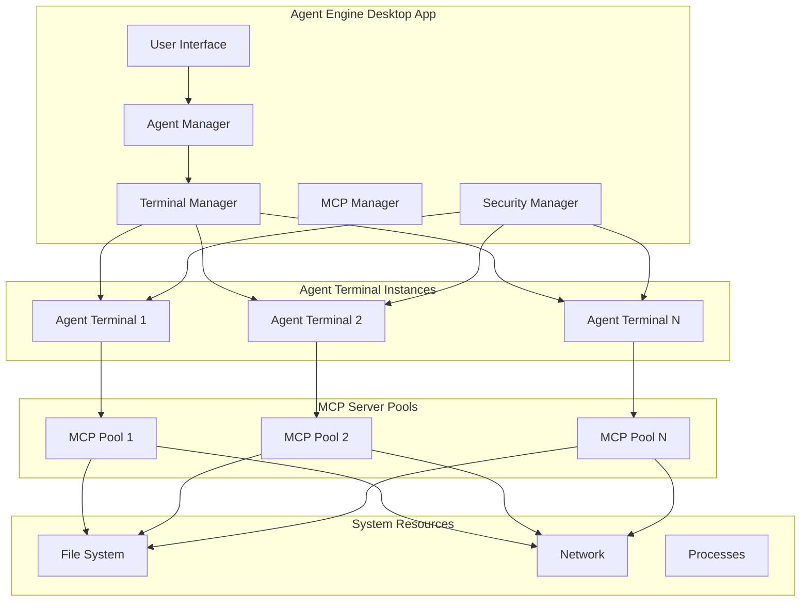

# Design Document

## Overview

This design implements a robust agent-terminal architecture where each AI agent operates as an isolated terminal instance with dedicated MCP server management. The system provides secure, scalable, and maintainable agent execution environments.

## Architecture

### High-Level Architecture



### Core Components

#### 1. Agent Terminal Manager
- **Purpose**: Manages lifecycle of agent terminal instances
- **Responsibilities**:
  - Create/destroy isolated terminal sessions
  - Maintain terminal state persistence
  - Handle terminal I/O streaming
  - Enforce resource limits and security policies

#### 2. MCP Process Manager (Enhanced)
- **Purpose**: Manages MCP server installation and execution per agent
- **Responsibilities**:
  - Install MCP tools using uvx/npx in agent terminals
  - Start/stop/restart MCP servers
  - Handle JSON-RPC communication
  - Monitor server health and performance

#### 3. Agent Execution Environment
- **Purpose**: Provides isolated execution context for each agent
- **Responsibilities**:
  - Maintain working directory and environment variables
  - Execute shell commands securely
  - Stream real-time output to UI
  - Handle process cleanup on termination

#### 4. Security Sandbox
- **Purpose**: Enforces security boundaries for agent operations
- **Responsibilities**:
  - File system access controls
  - Network permission management
  - API access control and rate limiting
  - Terminal command whitelisting/blacklisting
  - Environment variable security
  - Resource usage monitoring
  - Audit logging for security events

## Components and Interfaces

### AgentTerminalManager Interface

```dart
abstract class AgentTerminalManager {
  /// Create a new terminal instance for an agent
  Future<AgentTerminal> createTerminal(String agentId, AgentTerminalConfig config);
  
  /// Get existing terminal for an agent
  AgentTerminal? getTerminal(String agentId);
  
  /// Execute command in agent's terminal with security validation
  Future<CommandResult> executeCommand(String agentId, String command, {bool requiresApproval = false});
  
  /// Execute API call through agent's secure context
  Future<APICallResult> executeAPICall(String agentId, String provider, String model, Map<String, dynamic> request);
  
  /// Stream terminal output
  Stream<TerminalOutput> streamOutput(String agentId);
  
  /// Validate command against security policies
  Future<SecurityValidationResult> validateCommand(String agentId, String command);
  
  /// Destroy terminal and cleanup resources
  Future<void> destroyTerminal(String agentId);
  
  /// Get all active terminals
  List<AgentTerminal> getActiveTerminals();
}
```

### MCPServerManager Interface

```dart
abstract class MCPServerManager {
  /// Install MCP server in agent's terminal
  Future<MCPInstallResult> installServer(String agentId, String serverId);
  
  /// Start MCP server for agent
  Future<MCPServerProcess> startServer(String agentId, String serverId, Map<String, String> credentials);
  
  /// Stop MCP server
  Future<bool> stopServer(String agentId, String serverId);
  
  /// Get server status
  MCPServerStatus getServerStatus(String agentId, String serverId);
  
  /// List all servers for agent
  List<MCPServerProcess> getAgentServers(String agentId);
  
  /// Handle JSON-RPC communication
  Future<dynamic> sendMCPRequest(String agentId, String serverId, Map<String, dynamic> request);
}
```

### AgentTerminal Interface

```dart
abstract class AgentTerminal {
  String get agentId;
  String get workingDirectory;
  Map<String, String> get environment;
  TerminalStatus get status;
  DateTime get createdAt;
  DateTime get lastActivity;
  
  /// Execute command and return result
  Future<CommandResult> execute(String command);
  
  /// Execute command and stream output
  Stream<String> executeStream(String command);
  
  /// Change working directory
  Future<void> changeDirectory(String path);
  
  /// Set environment variable
  Future<void> setEnvironment(String key, String value);
  
  /// Get terminal history
  List<CommandHistory> getHistory();
  
  /// Kill all processes and cleanup
  Future<void> terminate();
}
```

## Data Models

### AgentTerminal Model

```dart
class AgentTerminal {
  final String agentId;
  final String sessionId;
  final String workingDirectory;
  final Map<String, String> environment;
  final TerminalStatus status;
  final DateTime createdAt;
  final DateTime lastActivity;
  final List<String> commandHistory;
  final Map<String, MCPServerProcess> mcpServers;
  final SecurityContext securityContext;
  final ResourceLimits resourceLimits;
}
```

### MCPServerProcess Model

```dart
class MCPServerProcess {
  final String serverId;
  final String agentId;
  final String processId;
  final int pid;
  final MCPServerStatus status;
  final DateTime startedAt;
  final DateTime? stoppedAt;
  final Map<String, String> credentials;
  final List<String> capabilities;
  final MCPTransportConfig transport;
  final List<String> logs;
  final Map<String, dynamic> metrics;
}
```

### CommandResult Model

```dart
class CommandResult {
  final String command;
  final int exitCode;
  final String stdout;
  final String stderr;
  final Duration executionTime;
  final DateTime timestamp;
  final Map<String, dynamic> metadata;
}
```

### SecurityContext Model

```dart
class SecurityContext {
  final String agentId;
  final List<String> allowedCommands;
  final List<String> blockedCommands;
  final Map<String, String> allowedPaths;
  final List<String> allowedNetworkHosts;
  final Map<String, APIPermission> apiPermissions;
  final ResourceLimits resourceLimits;
  final bool auditLogging;
  final TerminalPermissions terminalPermissions;
}

class APIPermission {
  final String provider; // 'anthropic', 'openai', 'local'
  final List<String> allowedModels;
  final int maxRequestsPerMinute;
  final int maxTokensPerRequest;
  final bool canMakeDirectCalls;
  final Map<String, String> requiredHeaders;
  final Map<String, String> secureCredentials;
}

class TerminalPermissions {
  final bool canExecuteShellCommands;
  final bool canInstallPackages;
  final bool canModifyEnvironment;
  final bool canAccessNetwork;
  final List<String> commandWhitelist;
  final List<String> commandBlacklist;
  final Map<String, String> secureEnvironmentVars;
  final bool requiresApprovalForAPIcalls;
}
```

## Error Handling

### Terminal Errors
- **TerminalCreationException**: Failed to create terminal instance
- **TerminalExecutionException**: Command execution failed
- **TerminalTimeoutException**: Command exceeded timeout limit
- **TerminalSecurityException**: Security policy violation

### MCP Server Errors
- **MCPInstallationException**: Failed to install MCP server
- **MCPStartupException**: Server failed to start
- **MCPCommunicationException**: JSON-RPC communication failed
- **MCPAuthenticationException**: Authentication/credentials invalid

### Recovery Strategies
1. **Automatic Retry**: Retry failed operations with exponential backoff
2. **Graceful Degradation**: Continue operation without failed components
3. **Resource Cleanup**: Ensure proper cleanup on failures
4. **User Notification**: Provide clear error messages and recovery options

## Testing Strategy

### Unit Tests
- **Terminal Management**: Test terminal creation, execution, cleanup
- **MCP Server Management**: Test installation, startup, communication
- **Security Controls**: Test permission enforcement and sandboxing
- **Error Handling**: Test all error scenarios and recovery

### Integration Tests
- **End-to-End Agent Workflows**: Test complete agent-terminal-MCP flows
- **Multi-Agent Scenarios**: Test isolation between multiple agents
- **Resource Management**: Test resource limits and cleanup
- **Performance**: Test with multiple concurrent agents and tools

### Performance Tests
- **Terminal Startup Time**: Measure terminal creation performance
- **MCP Server Installation**: Measure installation and startup times
- **Concurrent Operations**: Test performance with multiple agents
- **Memory Usage**: Monitor memory consumption over time

### Security Tests
- **Sandbox Escape**: Attempt to break out of security boundaries
- **Resource Exhaustion**: Test resource limit enforcement
- **File Access**: Test file system permission controls
- **Network Access**: Test network permission enforcement

## Deployment Considerations

### Resource Requirements
- **Memory**: 50-100MB per active agent terminal
- **CPU**: Minimal overhead, spikes during command execution
- **Disk**: 10-50MB per agent for logs and state
- **Network**: Depends on MCP server requirements

### Scalability Limits
- **Maximum Agents**: 50-100 concurrent agents (hardware dependent)
- **MCP Servers per Agent**: 10-20 servers recommended
- **Terminal History**: 1000 commands per agent (configurable)
- **Log Retention**: 30 days default (configurable)

### Security Considerations
- **Process Isolation**: Each agent runs in separate process group
- **File System Sandboxing**: Restrict access to agent-specific directories
- **Network Controls**: Optional network access restrictions
- **Credential Management**: Secure storage and injection of API keys
- **API Permission Management**: Control which LLM APIs agents can access
- **Terminal Execution Permissions**: Restrict which commands agents can execute
- **Environment Variable Security**: Secure injection of API keys into terminal environment
- **Audit Logging**: Comprehensive logging for security monitoring

### Monitoring and Observability
- **Health Checks**: Regular health checks for terminals and MCP servers
- **Metrics Collection**: Resource usage, performance, error rates
- **Log Aggregation**: Centralized logging for debugging and analysis
- **Alerting**: Notifications for failures and security events

## Implementation Phases

### Phase 1: Core Terminal Management
- Implement AgentTerminalManager
- Basic terminal creation and execution
- Command history and state persistence
- Resource cleanup on termination

### Phase 2: MCP Server Integration
- Enhanced MCPProcessManager
- Automatic MCP server installation
- JSON-RPC communication handling
- Server health monitoring and restart

### Phase 3: Security and Sandboxing
- File system access controls
- Resource limit enforcement
- Security audit logging
- Permission management UI

### Phase 4: Advanced Features
- Auto-discovery of project tools
- Performance optimization
- Advanced monitoring and metrics
- Multi-platform support enhancements