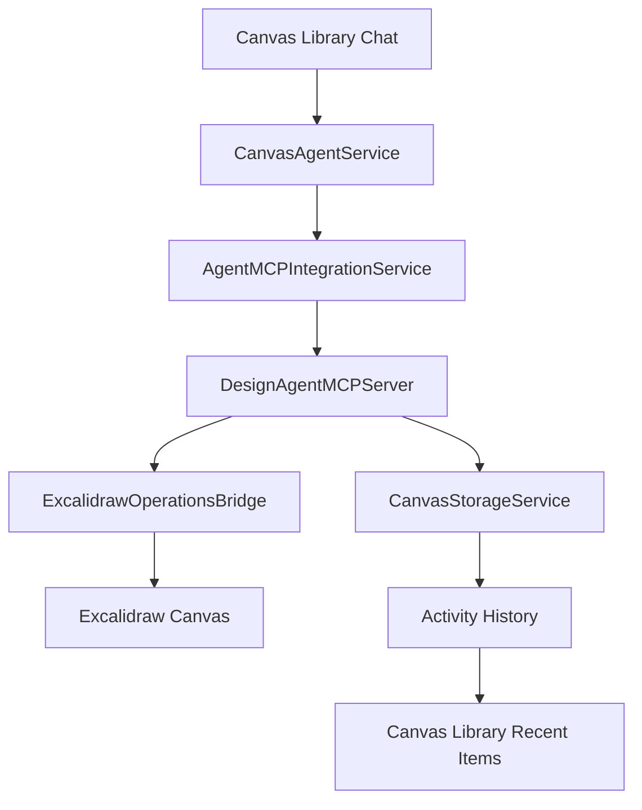

# Design Agent MCP Integration

## Overview

This document outlines the implementation plan for integrating the Design Agent with the Model Context Protocol (MCP) to enable direct canvas manipulation through natural language commands. The integration bridges the Canvas Library's agent chat interface with Excalidraw canvas operations.

## Current State Analysis

### Existing Infrastructure
- ✅ **Canvas Storage Service**: Handles canvas state persistence and agent activity tracking
- ✅ **Canvas Library UI**: Provides agent chat interface with activity history
- ✅ **MCP Foundation**: Core MCP services and bridge architecture exist
- ✅ **Excalidraw Integration**: WebView-based canvas with JavaScript bridge
- ⚠️ **Missing Link**: Agent chat not connected to actual canvas operations

### Architecture Gap
```
[Canvas Library Agent Chat] --❌--> [Canvas Operations]
                            |
                            ✅
                            v
                    [Static Responses]
```

**Goal**: Replace static responses with real canvas manipulation.

## Implementation Plan

### Phase 1: Foundation (Days 1-2)

#### 1.1 Audit Canvas MCP Package
**File**: `packages/asmbli-canvas-mcp/`

**Tasks**:
- Document existing canvas operation capabilities
- Identify supported Excalidraw element types
- Map JavaScript API methods available via WebView bridge
- Test current state management and persistence

**Deliverable**: Canvas MCP API documentation

#### 1.2 Excalidraw Bridge Assessment  
**File**: `apps/desktop/lib/features/canvas/presentation/excalidraw_canvas_screen.dart`

**Tasks**:
- Examine WebView JavaScript bridge setup
- Document communication channels between Flutter and Excalidraw
- Test programmatic element creation capabilities
- Validate state synchronization

**Deliverable**: Excalidraw integration capabilities report

### Phase 2: MCP Tool Definitions (Day 3)

#### 2.1 Canvas Tool Schema
Create MCP tool definitions for canvas operations:

```json
{
  "tools": [
    {
      "name": "create_shape",
      "description": "Create geometric shapes on canvas",
      "inputSchema": {
        "type": "object",
        "properties": {
          "shape_type": {
            "type": "string",
            "enum": ["rectangle", "circle", "diamond", "arrow"]
          },
          "position": {
            "type": "object", 
            "properties": {
              "x": {"type": "number"},
              "y": {"type": "number"}
            }
          },
          "properties": {
            "type": "object",
            "properties": {
              "width": {"type": "number"},
              "height": {"type": "number"},
              "fillColor": {"type": "string"},
              "strokeColor": {"type": "string"}
            }
          }
        }
      }
    },
    {
      "name": "add_text",
      "description": "Add text elements to canvas",
      "inputSchema": {
        "type": "object",
        "properties": {
          "content": {"type": "string"},
          "position": {
            "type": "object",
            "properties": {
              "x": {"type": "number"},
              "y": {"type": "number"}
            }
          },
          "styling": {
            "type": "object",
            "properties": {
              "fontSize": {"type": "number"},
              "fontFamily": {"type": "string"},
              "color": {"type": "string"}
            }
          }
        }
      }
    },
    {
      "name": "create_template",
      "description": "Generate pre-built templates",
      "inputSchema": {
        "type": "object",
        "properties": {
          "template_type": {
            "type": "string",
            "enum": ["wireframe", "flowchart", "dashboard", "mindmap"]
          },
          "layout": {"type": "string"},
          "components": {"type": "array"}
        }
      }
    },
    {
      "name": "clear_canvas", 
      "description": "Clear all elements from canvas",
      "inputSchema": {
        "type": "object",
        "properties": {
          "confirm": {"type": "boolean"}
        }
      }
    }
  ]
}
```

#### 2.2 Canvas MCP Server Implementation
**New File**: `apps/desktop/lib/core/services/design_agent_mcp_server.dart`

```dart
class DesignAgentMCPServer extends MCPServer {
  final CanvasStorageService _canvasStorage;
  final ExcalidrawBridge _excalidrawBridge;

  @override
  Future<MCPToolResult> executeTool(String toolName, Map<String, dynamic> args) async {
    switch (toolName) {
      case 'create_shape':
        return await _createShape(args);
      case 'add_text':
        return await _addText(args);
      case 'create_template':
        return await _createTemplate(args);
      case 'clear_canvas':
        return await _clearCanvas(args);
      default:
        throw MCPException('Unknown tool: $toolName');
    }
  }
}
```

### Phase 3: Agent Integration (Day 4)

#### 3.1 Canvas Agent Service
**New File**: `apps/desktop/lib/core/services/canvas_agent_service.dart`

```dart
class CanvasAgentService {
  final AgentMCPIntegrationService _mcpIntegration;
  final DesignAgentMCPServer _canvasServer;
  final CanvasStorageService _canvasStorage;

  Future<String> processCanvasMessage(String message) async {
    // Parse user intent
    final intent = await _parseDesignIntent(message);
    
    // Execute via MCP
    final result = await _mcpIntegration.processMessage(
      message: message,
      enabledServerIds: ['design_agent_mcp'],
      agentId: 'canvas_design_agent',
    );
    
    // Log activity
    await _logCanvasActivity(intent, result);
    
    return result.response;
  }
}
```

#### 3.2 Update Canvas Library Integration
**File**: `apps/desktop/lib/features/canvas/presentation/canvas_library_screen.dart`

**Changes**:
```dart
// Replace static _processCanvasAgentMessage
Future<String> _processCanvasAgentMessage(String message) async {
  final canvasAgent = ServiceLocator.instance.get<CanvasAgentService>();
  return await canvasAgent.processCanvasMessage(message);
}
```

### Phase 4: Excalidraw Bridge (Day 5)

#### 4.1 Canvas Operations Bridge
**New File**: `apps/desktop/lib/core/services/excalidraw_operations_bridge.dart`

```dart
class ExcalidrawOperationsBridge {
  final WebViewController _webController;

  Future<void> createElement(CanvasElement element) async {
    final jsCommand = _generateCreateElementJS(element);
    await _webController.runJavaScript(jsCommand);
  }

  String _generateCreateElementJS(CanvasElement element) {
    switch (element.type) {
      case ElementType.rectangle:
        return '''
          window.excalidrawAPI.updateScene({
            elements: [
              ...window.excalidrawAPI.getSceneElements(),
              {
                type: "rectangle",
                x: ${element.x},
                y: ${element.y}, 
                width: ${element.width},
                height: ${element.height},
                backgroundColor: "${element.fillColor}",
                strokeColor: "${element.strokeColor}",
                id: "${element.id}"
              }
            ]
          });
        ''';
      // Additional cases...
    }
  }
}
```

#### 4.2 Activity Logging Enhancement
**File**: `apps/desktop/lib/core/services/canvas_storage_service.dart`

**Enhancement**:
```dart
Future<void> saveCanvasAgentActivity(Map<String, dynamic> activity) async {
  const activitiesKey = 'canvas_agent_activities';
  final activities = getCanvasActivities();
  
  activities.insert(0, {
    ...activity,
    'timestamp': DateTime.now().toIso8601String(),
    'id': DateTime.now().millisecondsSinceEpoch.toString(),
  });
  
  // Keep last 50 activities
  if (activities.length > 50) {
    activities.removeRange(50, activities.length);
  }
  
  await _storage.setPreference(activitiesKey, activities);
}
```

## Data Flow Architecture



## Example User Interactions

### 1. Shape Creation
**User**: "Create a blue circle in the center"

**Agent Process**:
1. Parse intent: `create_shape(circle, center_position, blue_fill)`
2. MCP tool call: `create_shape({shape_type: "circle", position: {x: 400, y: 300}, properties: {fillColor: "blue"}})`
3. JavaScript execution: Add circle element to Excalidraw
4. Activity log: "Created blue circle" with timestamp
5. Response: "I've created a blue circle in the center of your canvas."

### 2. Template Generation  
**User**: "Make a dashboard wireframe"

**Agent Process**:
1. Parse intent: `create_template(dashboard, wireframe_layout)`
2. MCP tool call: `create_template({template_type: "dashboard", layout: "standard"})`
3. JavaScript execution: Generate multiple UI elements
4. Activity log: "Generated dashboard wireframe template"
5. Response: "I've created a dashboard wireframe with header, sidebar, and content areas."

## Testing Strategy

### Unit Tests
- Canvas agent service message processing
- MCP tool execution for each canvas operation
- JavaScript bridge communication
- Activity logging and retrieval

### Integration Tests
- End-to-end agent command to canvas element creation
- Canvas state persistence after agent modifications
- Activity history accuracy and display

### User Acceptance Tests
- Natural language commands produce expected canvas changes
- Agent responses are helpful and accurate
- Canvas library history properly reflects agent activities

## Success Metrics

- ✅ Agent can create basic shapes (rectangle, circle, text)
- ✅ Template generation works for wireframes and flowcharts
- ✅ Canvas operations persist and reload correctly
- ✅ Activity history shows accurate agent actions with timestamps
- ✅ Agent responses provide meaningful feedback about actions taken
- ✅ Error handling gracefully manages invalid commands

## Risk Mitigation

### Canvas State Corruption
- Implement state validation before operations
- Maintain operation rollback capabilities
- Regular auto-save with version history

### JavaScript Bridge Failures
- Robust error handling for WebView communication
- Fallback to manual canvas operations
- Clear error messages for users

### Performance Issues
- Limit concurrent canvas operations
- Optimize JavaScript payload size
- Implement operation queuing for complex templates

## Future Enhancements

### Advanced Operations
- Layer management and z-index control
- Group and ungroup elements
- Advanced styling and animations
- Import/export integration

### AI Improvements  
- Better intent parsing for complex commands
- Context awareness from existing canvas elements
- Smart positioning and layout suggestions
- Visual similarity detection for element relationships

---

This integration transforms the Canvas Library from a static interface into a powerful AI-powered design tool, enabling users to create and modify visual content through natural language commands while maintaining full history and state management.